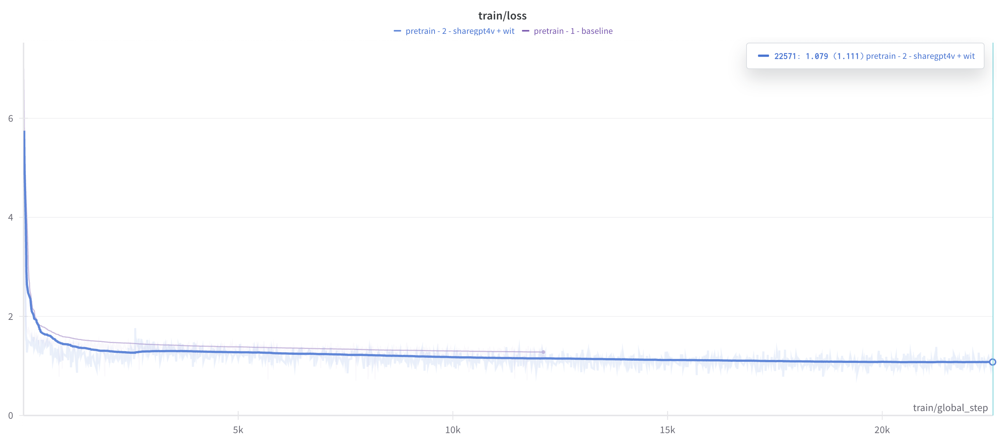
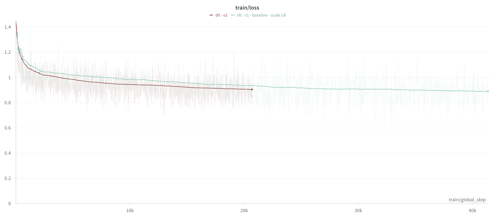
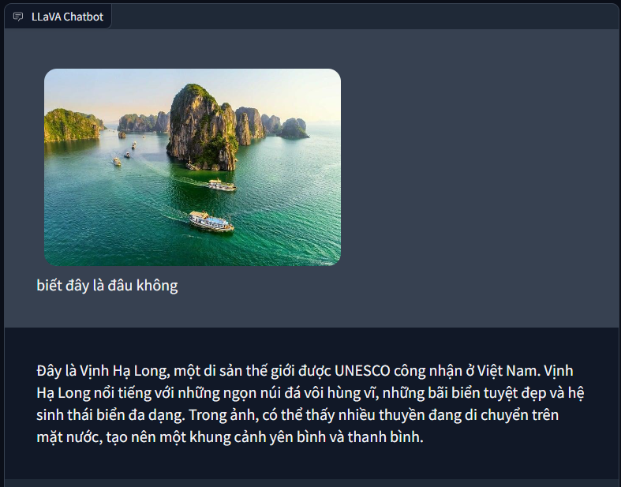
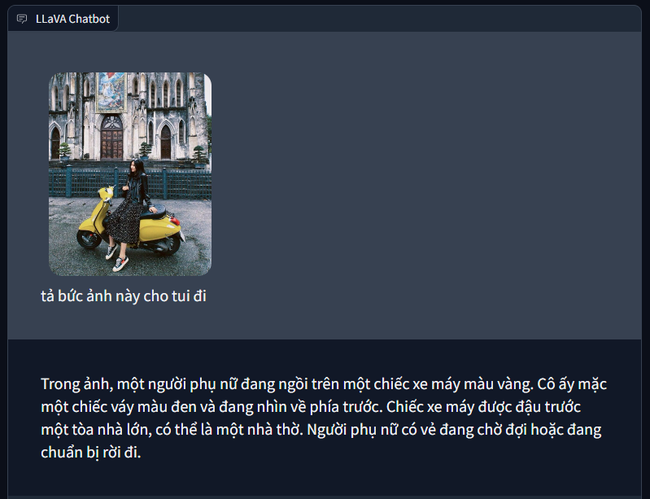
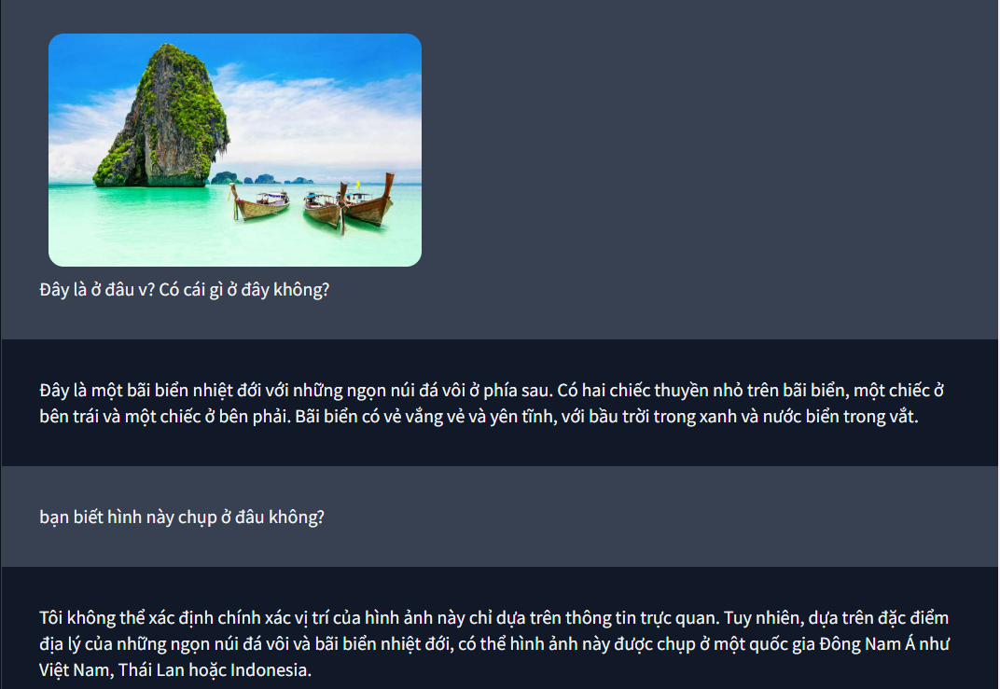
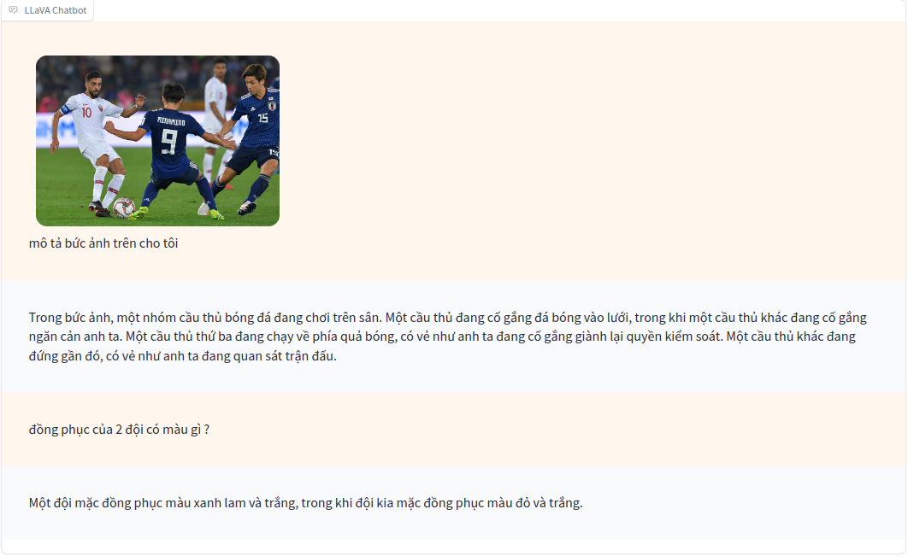
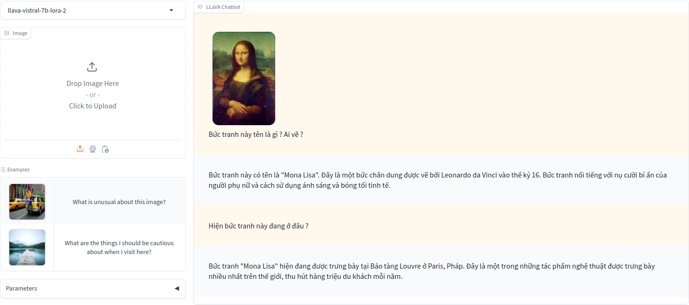
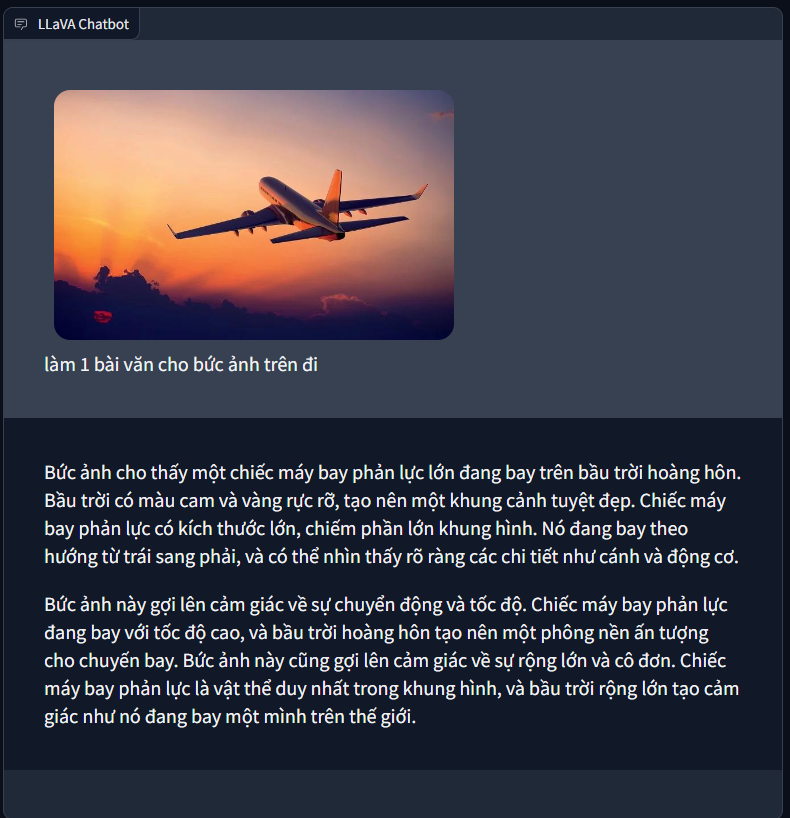
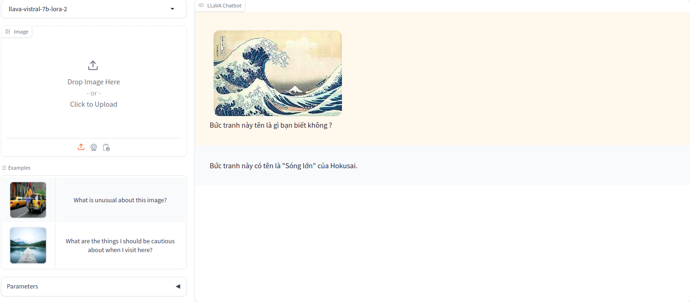
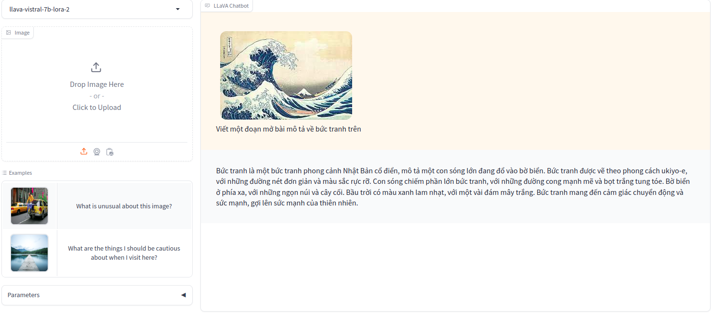

# Vistral-V (Vistral-Vision) - Visual Instruction Tuning for Vistral - Vietnamese Large Vision-Language Model.

## Contents
- [Quick start Notebook](#quick-start-notebook)
- [Install](#install)
- [Train](#train)
- [Demo](#demo)
- [Examples](#examples)

## Quick Start Notebook

You can follow the notebooks here to inference the Vistral-V model.

[](https://kaggle.com/kernels/welcome?src=https://github.com/hllj/Vistral-V/blob/master/assets/quickstart_example.ipynb)


## Install

If you are not using Linux, do *NOT* proceed, see instructions for [macOS](https://github.com/haotian-liu/LLaVA/blob/main/docs/macOS.md) and [Windows](https://github.com/haotian-liu/LLaVA/blob/main/docs/Windows.md).

1. Clone this repository and navigate to LLaVA folder
```bash
git clone https://github.com/hllj/Vistral-V.git
cd Vistral-V
```

2. Install Package
```Shell
conda create -n llava python=3.10 -y
conda activate llava
pip install --upgrade pip  # enable PEP 660 support
pip install -e .
```

```Shell
pip install -r requirements.txt
```

3. Install additional packages for training cases
```
pip install -e ".[train]"
pip install flash-attn --no-build-isolation
```

### Upgrade to latest code base

```Shell
git pull
pip install -e .

# if you see some import errors when you upgrade,
# please try running the command below (without #)
# pip install flash-attn --no-build-isolation --no-cache-dir
```

## Train

You can refer to the [Training model instructions](https://github.com/haotian-liu/LLaVA?tab=readme-ov-file#train) from the original LLaVA repository.

Below are the recipes to train the Vistral-V model through 2 stages: Pretrain - feature alignment and Finetune - visual instruction tuning. In this tutorial, we only use 1-2 device gpu NVIDIA A100 40Gb.

### Pretrain (feature alignment)

For this phase, the model will train a projector to align features between the vision encoder and the language model.

You can retrain this stage using the instructions below, or use the [training results for the pretraining stage here](https://huggingface.co/Vi-VLM/llava-vistral-7b-pretrain).

#### Data preparation

Pretrain dataset includes 2 subsets:
- ShareGPT4V
- WIT

Pretrain dataset includes image-text data pairs with requirements to describe the image with high quality caption.

You can refer to instructions from LLaVA to create more custom datasets [here](./docs/Data.md).

```bash
python data/create_dataset_images.py --local-dir <IMAGE DIR> --stage pretrain

DATA_DIR=<IMAGE DIR>/images bash data/extract_pretrain_images.sh

python data/create_dataset_json.py --local-dir <IMAGE DIR>/images --stage pretrain
```

#### Training

At this stage we scale data with 2 versions.

- Version 1: Pretrain with ShareGPT4V dataset only. Dataset size for version 1 is around 100k samples.

- Version 2: Pretrain with ShareGPT4V + WIT dataset. Dataset size for version 2 is around 340k samples.

We use the [multilingual SigLIP](https://huggingface.co/google/siglip-base-patch16-256-multilingual) model instead of CLIP in LLaVA because the ability to understand Vietnamese and features from SigLIP is much better than CLIP.

You can refer to the recipes we used for 2 versions here.

[Version 1 script](./scripts/vistral_llava/pretrain_v1.sh):

```bash
bash scripts/vistral_llava/pretrain_v1.sh
```

[Version 2 script](./scripts/vistral_llava/pretrain_v2.sh):

```bash
bash scripts/vistral_llava/pretrain_v1.sh
```

#### Loss Curve



A few comments on the results:

- Perform projector training so that the feature alignment between the vision feature and the language feature converges to a loss of about 0.9 - 1.1
- After scaling more data (version 2) for training, it shows that the model has better convergence.

### Finetune (visual instruction tuning)

This is the stage of finetuning the Language model and projector with the frozen Vision Encoder, to learn the visual instruction dataset.

#### Data preparation

Finetune dataset includes LLaVA-style data covering 3 different types of tasks:: conversation, complex reasoning, detail description.

```bash
python data/create_dataset_images.py --local-dir <IMAGE DIR> --stage finetune

DATA_DIR=<IMAGE DIR>/images bash data/extract_finetune_images.sh

python data/create_dataset_json.py --local-dir <IMAGE DIR>/images --stage finetune
```

#### Training

For the two versions of the pretrain phase, we also tried finetune to see the results.

Currently due to limitations in available hardware, we only implement finetune with LoRA. However, according to my guess, if you fully refine the Language Model, you can get better results.

In addition to changing the data for the pretrain/finetune, we also made adjustments to match the device's existing VRAM amount of 40Gb GPU VRAM: **adjust the batch size and scale down the learning rate**.

[Version 1 script](./scripts/vistral_llava/finetune_lora_v1.sh):
```bash
bash scripts/vistral_llava/finetune_lora_v1.sh
```

[Version 2 script](./scripts/vistral_llava/finetune_lora_v2.sh):
```bash
bash scripts/vistral_llava/finetune_lora_v2.sh
```

#### Merge and Push to Hub (optional)

```bash
python upload_merge_model.py \
    --model-path <lora checkpoint dir> \
    --model-base Viet-Mistral/Vistral-7B-Chat \
    --save-merged-model --save-dir <merged checkpoint dir> \
    --push-to-hub --repo-id <repo id HF>
```

Example:

```bash
python upload_merge_model.py --model-path checkpoints/llava-vistral-7b-lora-2 --model-base Viet-Mistral/Vistral-7B-Chat --save-merged-model --save-dir checkpoints/Vistral-V-7B/ --push-to-hub --repo-id Vi-VLM/Vistral-V-7B
```

### Loss Curve



A few comments on the results:

- Finetune on the LLaVA data set gives quite good loss results, about 0.7 - 0.9. Demonstrating the ability of the trained pretrain model to converge relatively quickly on LLaVA data.

- Version 2 relies on pretraining on more data for better loss after training than version 1. 

In fact, with version 2, we trained on 2 devices, the actual batch size will be double that of version 1, so that's it. Can also be a reason for better loss.

## CLI

You can quickly test the model using the simple CLI as follows.

```bash
python -m llava.serve.cli --model-path <repo_id or checkpoint dir> --image-file ./assets/images/example.jpeg
```

Example:

```bash
python -m llava.serve.cli --model-path Vi-VLM/Vistral-V-7B --image-file ./assets/images/example.jpeg
```

## Demo

You can follow the instructions of the original LLaVA repository [here](https://github.com/haotian-liu/LLaVA?tab=readme-ov-file#demo) to start the models after training. Here we will show how to start a Vistral-V service for our current LoRA model.

### Launch a controller

```bash
python -m llava.serve.controller --host 0.0.0.0 --port 10000
```

### Launch a gradio web server.

```bash
python -m llava.serve.gradio_web_server --controller http://localhost:10000 --model-list-mode reload
```

### Launch a model worker

Start a model worker to start serving your model, the script supports multi device inference.

#### LoRA, unmerged

After training the model with LoRA you can start the model worker or download our lora checkpoint.

```bash
python -m llava.serve.model_worker --host 0.0.0.0 --controller http://localhost:10000 --port 40000 --worker http://localhost:40000 --model-path Vi-VLM/llava-vistral-7b-lora --model-base Viet-Mistral/Vistral-7B-Chat
```

or 

```bash
python -m llava.serve.model_worker --host 0.0.0.0 --controller http://localhost:10000 --port 40000 --worker http://localhost:40000 --model-path <lora checkpoint dir> --model-base Viet-Mistral/Vistral-7B-Chat
```

### Fully Finetuned Model / Merged Model

You can use a fully finetuned or merged model (if merging lora, see the [instructions above](#merge-and-push-to-hub-optional)), you can use our model checkpoint.

```bash
python -m llava.serve.model_worker --host 0.0.0.0 --controller http://localhost:10000 --port 40000 --worker http://localhost:40000 --model-path Vi-VLM/Vistral-V-7B
```

or

```bash
python -m llava.serve.model_worker --host 0.0.0.0 --controller http://localhost:10000 --port 40000 --worker http://localhost:40000 --model-path <model checkpoint dir>
```

### Examples

















## Evaluation

Currently, Vistral-V has not been run on any specific benchmark for the Vision-Language Benchmark. We will conduct an evaluation in some tasks and update as soon as possible.

## Additional Information

- Organization: [Vietnamese-VLM](https://huggingface.co/Vi-VLM)

- Contact: [Bui Van Hop](https://github.com/hllj)

## Acknowledgement

- [LLaVA](https://github.com/haotian-liu/LLaVA): We used most of the source code and instructions of the LLaVA repository and made a few modifications on it to suit the model architecture.

- [Vistral](https://huggingface.co/Viet-Mistral/Vistral-7B-Chat): We are very grateful to the Vistral development team for creating a great LLM for Vietnamese.

- [SigLIP](https://huggingface.co/google/siglip-base-patch16-256-multilingual): We also thank Google and the SigLIP authors for creating a very good Image-Text model, which we took advantage of useful features from the multilingual SigLIP model.

## Citation Information
